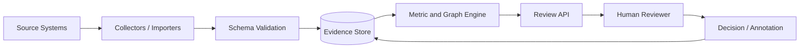

# Architecture — Software POE

## Context

## Domain entities

- `ArchitectureDecision`
- `Expectation`
- `Observation`
- `Gap`
- `Review`

## Recommended implementation slices

1. **Contract slice**：event schema、project manifest、synthetic fixtures。
2. **Collection slice**：只支援一種來源，保留 source identifier 與 ingestion timestamp。
3. **Analysis slice**：實作 1–2 個可解釋 metric，不先加入 ML。
4. **Review slice**：顯示 evidence、assumption、missing data 與 reviewer annotation。
5. **Evaluation slice**：以合成案例測試 false positive、缺失資料與反例。

## Data constraints

- Inputs: ADR 與設計假設, SLO/SLI, OpenTelemetry traces/metrics/logs, 雲端帳單, 事故與變更紀錄, 功能使用率
- Outputs: Architecture Performance Gap, 未實現 ADR 清單, 過度設計元件, 設計假設失效時間線
- 所有資料物件必須包含 `tenant_id`, `source`, `observed_at`, `ingested_at`, `schema_version`。
- 高敏感領域應在 collection edge 去識別或聚合。

## Scale path

- Phase 1: file-based fixtures + batch analysis
- Phase 2: PostgreSQL + object evidence + scheduled jobs
- Phase 3: graph/time-series storage + streaming ingestion
- Phase 4: multi-tenant policy enforcement + audit + model/rule registry
