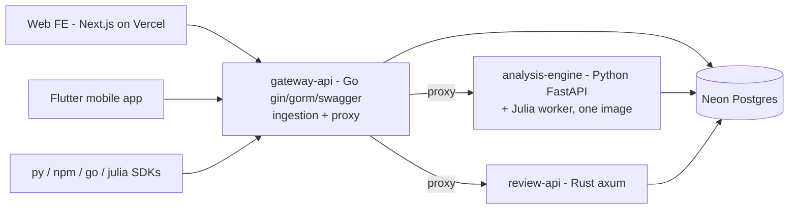

# Implementation Plan — Software POE

> **Status:** v1.0 — decisions confirmed with project owner on 2026-07-15.
> Supersedes DRAFT v0.1. Decision log in §8.

## 1. Purpose recap

Software POE（軟體使用後評估）applies Post-Occupancy Evaluation to software: did architecture promises, ADR assumptions and NFRs actually hold in production? The MVP ingests evidence events (synthetic data only), compares expected vs. actual, and produces explainable gap reports gated by human review.

MVP constraints from the blueprint:

- Single-tenant, synthetic data, read-only analysis.
- Every assessment has `human_review_required: true`.
- Every data object carries `tenant_id`, `source`, `observed_at`, `ingested_at`, `schema_version`.
- Evidence provenance (sha256 `evidence_ref` + append-only audit trail) is required.

## 2. Target architecture



### 2.1 Backend — Choreo (console.choreo.dev), exactly 3 Dockerfiles

| Service | Stack | Responsibility | Dockerfile |
|---|---|---|---|
| `services/gateway-api` | **Go** — gin, gorm, swaggo/swagger | `POST /v1/software-poe/events` (validate against `schemas/event.schema.json` semantics, stamp `ingested_at`, compute sha256 evidence hash, insert, enqueue analysis job) + reverse-proxy `/v1/software-poe/assessments*` to review-api and `/internal/analysis*` to analysis-engine | `services/gateway-api/Dockerfile` |
| `services/analysis-engine` | **Python + Julia**, two processes in one image | FastAPI process: job orchestration + DB access. Julia worker process: metric math (`intent_fulfillment_ratio`, `slo_gap` first). They communicate through the Postgres `analysis_jobs` table (DB-as-queue). Entrypoint script supervises both processes | `services/analysis-engine/Dockerfile` |
| `services/review-api` | **Rust** — axum, sqlx | `GET /v1/software-poe/assessments`, `POST /v1/software-poe/assessments/{id}/review` (reviewer decision + annotation, writes `reviews` + audit entry) | `services/review-api/Dockerfile` |

Each service ships a `.choreo/component.yaml` so Choreo picks up the Dockerfile and exposed port. **Auth: Choreo-managed API key** on the exposed gateway endpoint (configured in the Choreo console; services trust the gateway inside the project boundary). Local dev uses an `X-API-Key` check in the gateway with `API_KEY` env var to keep parity.

### 2.2 Database — Neon (serverless Postgres)

- Connection via `DATABASE_URL` env var (Neon pooled connection string) injected by Choreo; local dev uses Postgres 16 in docker compose.
- Migrations in `db/migrations/*.sql` (plain SQL, applied by gateway-api at startup or via `psql`).
- Tables: `tenants`, `architecture_decisions`, `expectations`, `events` (observations), `gaps`, `assessments`, `reviews`, `analysis_jobs`, `audit_entries` (append-only).
- All evidence rows carry `tenant_id`, `source`, `observed_at`, `ingested_at`, `schema_version`, `evidence_ref`.

### 2.3 Frontend — Vercel

- `frontend/` — Next.js (App Router, TypeScript, Tailwind).
- Pages: Dashboard (metric baselines/trends), Gap report list, Review queue (evidence + assumption + missing-data display + annotation form).
- `NEXT_PUBLIC_API_BASE_URL` + `NEXT_PUBLIC_API_KEY` point at the Choreo gateway. Deployed via Vercel Git integration (root directory = `frontend/`).

### 2.4 Mobile — Flutter

- `mobile/` — standalone Flutter project (kept out of `frontend/`).
- MVP scope: review-only companion — review queue list, assessment detail, approve/reject with annotation.
- Same gateway endpoints; API base URL and key via `--dart-define`.

### 2.5 Published packages (client SDKs) — real registries

| Package | Registry | Path |
|---|---|---|
| `software-poe` | PyPI (trusted publishing/OIDC) | `sdk/python` |
| `@dennislee928/software-poe` | npmjs | `sdk/typescript` |
| `github.com/Jest-Test-Team/software-poe/sdk/go` | Go module proxy (git tag) | `sdk/go` |
| `SoftwarePOE.jl` | Julia General registry via JuliaRegistrator + TagBot | `sdk/julia` |

Each SDK: typed Event/Assessment models, client for ingest + assessments, schema-parity validation. Versions released by tag (`py-v*`, `npm-v*`, `sdk/go/v*`, Julia via `@JuliaRegistrator register` comment + TagBot).

## 3. Tests — Robot Framework (`tests/`)

Coverage required by `tests/README.md`: schema validation, missing data, stale evidence, counterexample, tenant isolation, rule versioning, human-review gate.

```
tests/
  robot/
    resources/common.resource   # keywords, API session, fixture loading
    schema_validation.robot
    missing_data.robot
    stale_evidence.robot
    counterexample.robot
    tenant_isolation.robot
    rule_versioning.robot
    human_review_gate.robot
  fixtures/                     # synthetic events: valid, invalid, adversarial
```

Black-box API tests via RequestsLibrary against the docker-compose stack (gateway on :8081).

## 4. CI/CD — GitHub Actions (`.github/workflows/`)

| Workflow | Trigger | Does |
|---|---|---|
| `ci.yml` | PR / push main | Go vet+build, Rust check+clippy, Python lint+pytest, Julia Pkg test, FE typecheck+build, SDK builds; build all 3 Docker images |
| `robot-tests.yml` | PR / push main | compose up (Postgres + 3 services) → run Robot suites → upload report artifact |
| `publish-python.yml` | tag `py-v*` | build sdk/python → publish to PyPI (OIDC trusted publishing) |
| `publish-npm.yml` | tag `npm-v*` | build sdk/typescript → `npm publish --access public` (needs `NPM_TOKEN` secret) |
| `publish-go.yml` | tag `sdk/go/v*` | verify module builds/tests, then warm `proxy.golang.org` |
| `publish-julia.yml` | TagBot on registry merge | `julia-actions/TagBot`; registration triggered by commenting `@JuliaRegistrator register subdir=sdk/julia` on the release commit |
| FE deploy | push main | Vercel Git integration (no workflow file) |
| BE deploy | push main | Choreo Git integration builds the 3 Dockerfiles |

Required repo secrets: `NPM_TOKEN`; PyPI uses trusted publishing (configure the repo/workflow on pypi.org); TagBot uses `GITHUB_TOKEN`.

## 5. Repo layout (target)

```
software-poe/
  frontend/                 # Next.js (Vercel)
  mobile/                   # Flutter
  services/
    gateway-api/            # Go gin/gorm/swagger + Dockerfile + .choreo/
    analysis-engine/        # Python FastAPI + Julia worker + Dockerfile + .choreo/
    review-api/             # Rust axum + Dockerfile + .choreo/
  sdk/
    python/  typescript/  go/  julia/
  db/migrations/
  tests/robot/  tests/fixtures/
  .github/workflows/
  docs/  schemas/  api/  examples/
  docker-compose.yml
```

## 6. Milestones

1. **M1 Contract & skeleton** — repo layout, migrations, 3 service skeletons + Dockerfiles + component.yaml, docker compose.
2. **M2 Vertical slice** — ingest → validate → store → Julia computes `intent_fulfillment_ratio` + `slo_gap` → assessment rows → review endpoints.
3. **M3 Surfaces** — Next.js dashboard/review UI; Flutter review companion.
4. **M4 Test & pipeline** — Robot suites green against compose stack in CI.
5. **M5 Release** — Choreo components + Vercel wired; first real tags published to PyPI / npm / Go proxy / Julia General.

## 7. Risks & notes

- **Julia General registry** review can take days and enforces naming/version rules; `SoftwarePOE` name must be unique. TagBot only fires after the registry PR merges.
- **DB-as-queue** (`analysis_jobs`) is deliberate MVP simplicity; replace with a real queue in the Phase-3 streaming path.
- **Choreo 3-component limit** honored: exactly 3 Dockerfiles; Postgres is external (Neon), never containerized in deploy.
- Real-registry publishing means a bad tag is public: tags are protected by workflow-side build+test gates before the publish step.

## 8. Decision log (grilling session, 2026-07-15)

| Question | Decision |
|---|---|
| "neo" database | **Neon (serverless Postgres)** — not Neo4j |
| Backend split | Go gin/gorm/swagger **gateway (API + proxy)**; **Python + Julia** analysis (two processes, one image); **Rust** review API |
| Py/Julia cooperation | Two processes in one container, queue = Postgres jobs table |
| Auth | **Choreo-managed API key** (local parity via `X-API-Key`) |
| npm scope | `@dennislee928/software-poe` |
| PyPI / Go / Julia names | `software-poe` / `github.com/Jest-Test-Team/software-poe/sdk/go` / `SoftwarePOE.jl` |
| Julia publishing | Tag + JuliaRegistrator → General registry, TagBot |
| Publish mode | **Real registries from the first tag** |
| Flutter scope | Review-only companion app (default, not contested) |
